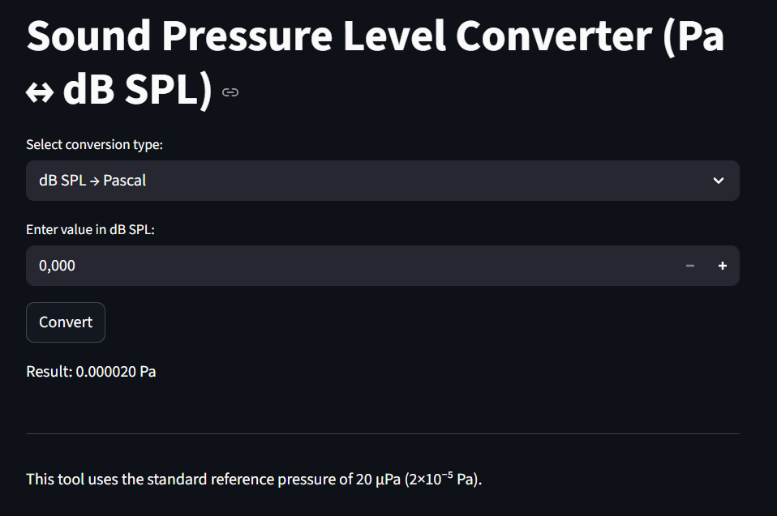

# Sound Pressure Level Converter (Pa ↔ dB SPL)

A simple yet powerful tool to convert between **sound pressure in Pascals** and **sound pressure level in decibels (dB SPL)**. Built in **Python** using **Streamlit**.



## 🔧 Features

- Convert from **Pascal → dB SPL** and **dB SPL → Pascal**
- Warns when values are **below the threshold of human hearing**
- Based on the **standard reference pressure** of 20 μPa (2×10⁻⁵ Pa)
- Clean, modern UI — easy to use
- Includes context-sensitive descriptions (e.g. “soft whisper”, “normal conversation”)

## ▶️ How to Run the App

### 1. Install Python (if not yet installed)

👉 [Download Python](https://www.python.org/downloads/) and make sure `pip` is enabled.

### 2. Clone the repository

```bash
git clone https://github.com/your-username/sound-pressure-converter.git
cd sound-pressure-converter

## Install dependencies
pip install -r requirements.txt

## 🏃 Run the app with Streamlit
streamlit run app.py

## ✅ Example
Input: 0.02 Pa
Output: 60 dB SPL
Description: Normal conversation

## 🧠 Why this Tool?
Humans perceive sound logarithmically. That’s why we use dB instead of raw Pascal values.
This tool helps translate abstract sound pressures into meaningful values — including warnings when sound is inaudible.

## 📁 Files Included
- 'app.py' – the Streamlit app
- 'conversions.py' – logic for the conversions
- 'README.md' – this file
- 'requirements.txt' – packages you need to install

## 💡 Ideas for Future Versions
- Add visual scale or chart
- More unit options (e.g. dBA weighting)
- Expanded explanations about sound physics
    - Logarithmic scale
    - P0
    - Negative dB's
    - Frequencies
    - Weighting
- Add export/share feature

## 🙋‍♀ Contact
Built by SomethingwithJade
  `📝 [GitHub Repo](https://github.com/your-username/sound-pressure-converter)`
📸
```
